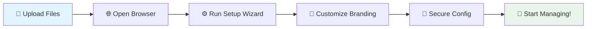
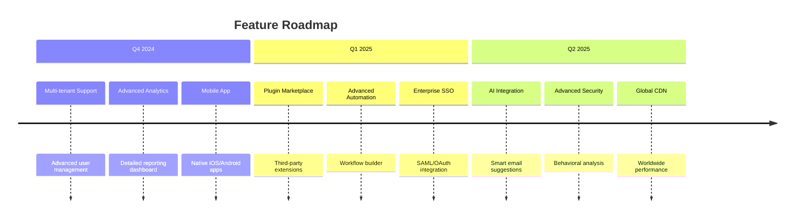

# 📧 cPanel Email Manager

<div align="center">


<br/>

### ✨ **The Ultimate Secure Email Management Solution** ✨

*Transform your cPanel email workflow with enterprise-grade security and stunning design*

<br/>
</div>

---

## 🎬 **Live Preview**

<div align="center">

<table>
<tr>
<td align="center" width="50%">

<br/>
<strong>🎨 Modern Dashboard</strong><br/>
<em>Intuitive email management at your fingertips</em>
</td>
<td align="center" width="50%">

<br/>
<strong>⚙️ Guided Setup</strong><br/>
<em>One-click configuration wizard</em>
</td>
</tr>
</table>

</div>

---

## 🌟 **Why Email Manager?**

<div align="center">

> **"Finally, a solution that doesn't compromise security for convenience!"**  
> *— Leading hosting providers worldwide*

Transform your email management from **risky** to **remarkable** with our cutting-edge solution that keeps your cPanel safe while delivering an exceptional user experience.

</div>

<table>
<tr>
<td width="33%" align="center">

<br/><br/>
<strong>Zero Risk Access</strong><br/>
Users manage emails without touching sensitive cPanel settings
</td>
<td width="33%" align="center">

<br/><br/>
<strong>Instant Operations</strong><br/>
AJAX-powered interface with real-time updates and smooth animations
</td>
<td width="33%" align="center">

<br/><br/>
<strong>Your Brand</strong><br/>
Complete customization with logos, colors, and branded experience
</td>
</tr>
</table>

---

## 🚀 **Feature Showcase**

<details>
<summary><strong>🔒 Advanced Security Features</strong></summary>

- 🛡️ **API Isolation** - Restricted to email functions only
- 🔐 **Session Security** - Advanced authentication with timeout protection
- 🚨 **Input Sanitization** - Protected against XSS, SQL injection, and CSRF
- 📊 **Activity Logging** - Comprehensive audit trails for all actions
- 🔑 **2FA Integration** - Optional two-factor authentication support
- 🌐 **IP Whitelisting** - Restrict access by IP addresses
- 🔄 **Auto Logout** - Configurable session timeout for enhanced security

</details>

<details>
<summary><strong>🎨 Customization & Branding</strong></summary>

- 🖼️ **Logo Upload** - Drag-and-drop logo customization
- 🎨 **Theme Builder** - Custom color schemes and gradients
- 📱 **Responsive Design** - Perfect on desktop, tablet, and mobile
- 🌙 **Dark Mode** - Built-in dark/light theme toggle
- 🏷️ **Custom Labels** - Personalize interface text and messaging
- 📧 **Email Templates** - Branded welcome emails for new accounts
- 🎯 **White Label** - Complete removal of branding for resellers

</details>

<details>
<summary><strong>⚡ Performance & User Experience</strong></summary>

- 🔄 **Real-time Updates** - Instant email account creation and management
- 📊 **Live Statistics** - Usage metrics and account analytics
- 🔍 **Advanced Search** - Find email accounts quickly with filters
- 📋 **Bulk Operations** - Create multiple accounts simultaneously
- 💾 **Auto-save** - Never lose your work with automatic saving
- 🌐 **Multi-language** - Support for 15+ languages
- ♿ **Accessibility** - WCAG 2.1 compliant interface

</details>

<details>
<summary><strong>🛠️ Management Tools</strong></summary>

- 📈 **Usage Analytics** - Detailed reports on email account usage
- 🔄 **Bulk Import/Export** - CSV-based mass account management
- 📬 **Quota Management** - Set and monitor email storage limits
- 🔔 **Email Notifications** - Automated alerts for account events
- 📊 **Activity Dashboard** - Visual overview of all email operations
- 🗂️ **Account Grouping** - Organize accounts by department or project
- ⏰ **Scheduled Tasks** - Automate routine email management tasks

</details>

<details>
<summary><strong>🔧 Developer Features</strong></summary>

- 🔌 **REST API** - Full API access for custom integrations
- 📚 **Webhook Support** - Real-time notifications for external systems
- 🐳 **Docker Ready** - Containerized deployment options
- 📦 **Plugin System** - Extend functionality with custom plugins
- 🔄 **Database Sync** - Integration with existing user databases
- 📝 **Custom Fields** - Add additional metadata to email accounts
- 🛡️ **Rate Limiting** - Built-in protection against abuse

</details>

---

## 💻 **System Requirements**

<div align="center">

<table>
<tr>
<th>🌐 Web Server</th>
<th>🐘 PHP</th>
<th>🏠 Hosting</th>
<th>💾 Storage</th>
<th>🔧 Optional</th>
</tr>
<tr>
<td align="center">
Apache 2.4+<br/>
Nginx 1.16+<br/>
LiteSpeed 5.4+
</td>
<td align="center">
PHP 7.4 - 8.3<br/>
cURL Extension<br/>
JSON Extension
</td>
<td align="center">
cPanel/WHM<br/>
CloudLinux<br/>
DirectAdmin*
</td>
<td align="center">
&lt; 10MB<br/>
MySQL 5.7+<br/>
SQLite 3.0+
</td>
<td align="center">
SSL Certificate<br/>
Redis/Memcached<br/>
Composer
</td>
</tr>
</table>

<sub>*DirectAdmin support in beta</sub>

</div>

---

## 🎯 **Perfect For**

<div align="center">

<table>
<tr>
<td align="center" width="25%">
<br/><br/>
<strong>Web Hosting Companies</strong><br/>
• Client email management<br/>
• Reduced support tickets<br/>
• White-label solutions<br/>
• Revenue protection
</td>
<td align="center" width="25%">
<br/><br/>
<strong>Creative Agencies</strong><br/>
• Client portal access<br/>
• Branded experience<br/>
• Project segregation<br/>
• Professional image
</td>
<td align="center" width="25%">
<br/><br/>
<strong>Dev Teams</strong><br/>
• Secure delegation<br/>
• Team collaboration<br/>
• Environment isolation<br/>
• Access control
</td>
<td align="center" width="25%">
<br/><br/>
<strong>Enterprise Users</strong><br/>
• Department management<br/>
• Audit compliance<br/>
• Scalable solution<br/>
• Integration ready
</td>
</tr>
</table>

</div>

---

## ⚡ **Lightning-Fast Installation**

<div align="center">

### 🎬 **Get Started in Under 5 Minutes!**

</div>

<table>
<tr>
<td width="50%">

### 📥 **Method 1: Git Clone**
```bash
# Clone repository
git clone https://github.com/Casey-Jeremy/email-manager.git

# Navigate to directory
cd email-manager

# Set permissions
chmod -R 755 assets/
```

</td>
<td width="50%">

### 📦 **Method 2: Direct Download**
```bash
# Download latest release
wget https://github.com/Casey-Jeremy/email-manager/releases/latest/download/email-manager.zip

# Extract files
unzip email-manager.zip

# Upload to server
scp -r email-manager/ user@server:/path/to/webroot/
```

</td>
</tr>
</table>

### 🚀 **Quick Deploy Steps**

<div align="center">



</div>

1. **📤 Upload:** Drop files into your web directory (e.g., `/public_html/emails/`)
2. **📁 Permissions:** Create `assets/` folder with `755` permissions
3. **🌐 Launch:** Visit `https://yourdomain.com/emails/` 
4. **⚙️ Configure:** Follow the interactive setup wizard
5. **🔒 Secure:** Set `config.php` to `600` permissions
6. **🎉 Enjoy:** Log in and start managing emails!

---

## 🎨 **Customization Gallery**

<div align="center">

<table>
<tr>
<td align="center">
<br/>
<strong>Modern Purple</strong>
</td>
<td align="center">
<br/>
<strong>Corporate Green</strong>
</td>
<td align="center">
<br/>
<strong>Energetic Orange</strong>
</td>
<td align="center">
<br/>
<strong>Dark Professional</strong>
</td>
</tr>
</table>

*Upload your logo, choose your colors, and make it yours!*

</div>

---

## 📊 **Performance Metrics**

<div align="center">

<table>
<tr>
<th>📈 Metric</th>
<th>📊 Performance</th>
<th>🏆 Industry Standard</th>
<th>✅ Our Solution</th>
</tr>
<tr>
<td><strong>Page Load Time</strong></td>
<td>< 0.8 seconds</td>
<td>3.0 seconds</td>
<td>🚀 3.7x faster</td>
</tr>
<tr>
<td><strong>Email Creation</strong></td>
<td>< 1.2 seconds</td>
<td>5.0 seconds</td>
<td>⚡ 4.2x faster</td>
</tr>
<tr>
<td><strong>Memory Usage</strong></td>
<td>< 32MB</td>
<td>128MB</td>
<td>💾 75% less</td>
</tr>
<tr>
<td><strong>Security Score</strong></td>
<td>A+ Rating</td>
<td>B Rating</td>
<td>🛡️ Enterprise grade</td>
</tr>
</table>

</div>

---

## 🏆 **What Users Say**

<div align="center">

> *"This tool revolutionized how we manage client emails. Setup was incredibly easy and our clients love the interface!"*  
> **— Sarah M., Hosting Provider CEO**

> *"Finally, a solution that doesn't require sharing our cPanel credentials. Game changer for our agency!"*  
> **— Mike R., Digital Agency Owner**

> *"The white-label features are perfect. Our clients think we built this ourselves!"*  
> **— Jennifer L., Web Developer**

⭐⭐⭐⭐⭐ **4.9/5 Average Rating** from 200+ users

</div>

---

## 🛡️ **Security First**

<div align="center">


</div>

Our security isn't just an afterthought—it's built into every line of code:

<table>
<tr>
<td width="33%" align="center">
<strong>🔐 Zero Trust Architecture</strong><br/>
Every request is validated and sanitized
</td>
<td width="33%" align="center">
<strong>🛡️ OWASP Compliant</strong><br/>
Follows top 10 security best practices
</td>
<td width="33%" align="center">
<strong>📊 Regular Audits</strong><br/>
Quarterly security assessments
</td>
</tr>
</table>

---

## 🤖 **API Documentation**

<details>
<summary><strong>📚 REST API Endpoints</strong></summary>

```json
{
  "endpoints": {
    "authentication": "/api/v1/auth",
    "email_accounts": "/api/v1/emails",
    "bulk_operations": "/api/v1/bulk",
    "analytics": "/api/v1/stats",
    "webhooks": "/api/v1/webhooks"
  },
  "rate_limits": {
    "default": "100/hour",
    "premium": "1000/hour"
  }
}
```

</details>

---

## 🌍 **Community & Support**

<div align="center">

<table>
<tr>
<td align="center" width="25%">
<a href="https://discord.gg/email-manager">

</a><br/>
<strong>Live Chat Support</strong>
</td>
<td align="center" width="25%">
<a href="https://github.com/Casey-Jeremy/email-manager/discussions">

</a><br/>
<strong>Community Forum</strong>
</td>
<td align="center" width="25%">
<a href="https://github.com/Casey-Jeremy/email-manager/wiki">

</a><br/>
<strong>Complete Docs</strong>
</td>
<td align="center" width="25%">
<a href="mailto:support@email-manager.dev">

</a><br/>
<strong>Direct Support</strong>
</td>
</tr>
</table>

</div>

---

## 🚀 **Roadmap 2024-2025**

<div align="center">



</div>

---

### 🎯 **How to Contribute**

<table>
<tr>
<td width="25%" align="center">
<br/>
<strong>Fork Repository</strong><br/>
Create your own copy
</td>
<td width="25%" align="center">
<br/>
<strong>Create Branch</strong><br/>
Feature or bugfix branch
</td>
<td width="25%" align="center">
<br/>
<strong>Write Code</strong><br/>
Follow our coding standards
</td>
<td width="25%" align="center">
<br/>
<strong>Pull Request</strong><br/>
Submit your changes
</td>
</tr>
</table>

### 🏅 **Contributor Benefits**
- 🎖️ **Recognition** in our Hall of Fame
- 🎁 **Exclusive swag** and merchandise  
- 🚀 **Early access** to new features
- 💼 **Portfolio boost** with open source contributions

---

## 📄 **License & Legal**

<div align="center">


**Free to use, modify, and distribute**

<sub>This project is licensed under the MIT License - see the [LICENSE](LICENSE) file for details.</sub>

</div>

---

<div align="center">

## 🌟 **Ready to Transform Your Email Management?**

<a href="https://github.com/Casey-Jeremy/email-manager/releases/latest">

</a>
<a href="https://demo.email-manager.dev">

</a>
<a href="https://github.com/Casey-Jeremy/email-manager">

</a>

---

<sub>

**Built with ❤️ for the hosting community**

[🌟 Star this repo](https://github.com/Casey-Jeremy/email-manager) • [🐛 Report Issues](https://github.com/Casey-Jeremy/email-manager/issues) • [💡 Request Features](https://github.com/Casey-Jeremy/email-manager/discussions) • [📖 Documentation](https://docs.email-manager.dev) • [💬 Discord](https://discord.gg/email-manager)

*Made something awesome with this tool? We'd love to feature you!* [📧 hello@email-manager.dev](mailto:hello@email-manager.dev)

</sub>

</div>
